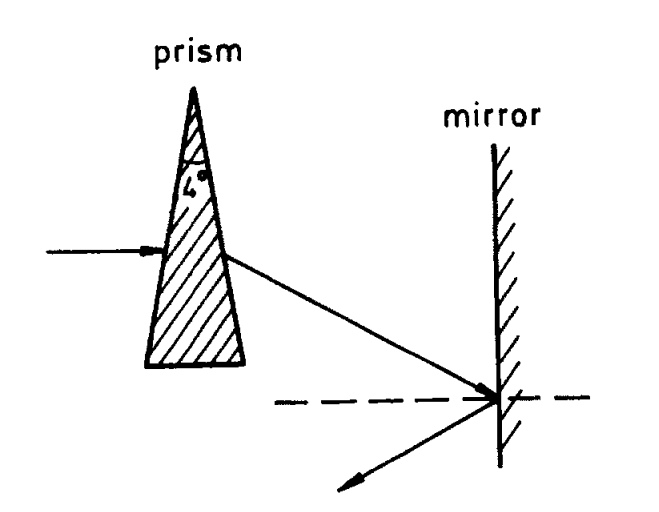

1002 Un rayo de luz horizontal atraviesa un prisma de índice de refracción 1.50 y un ángulo 4° y luego golpea un espejo vertical, como se muestra en la figura. ¿A qué ángulo debe girarse el espejo para que, después de la reflexión, el rayo sea horizontal?

