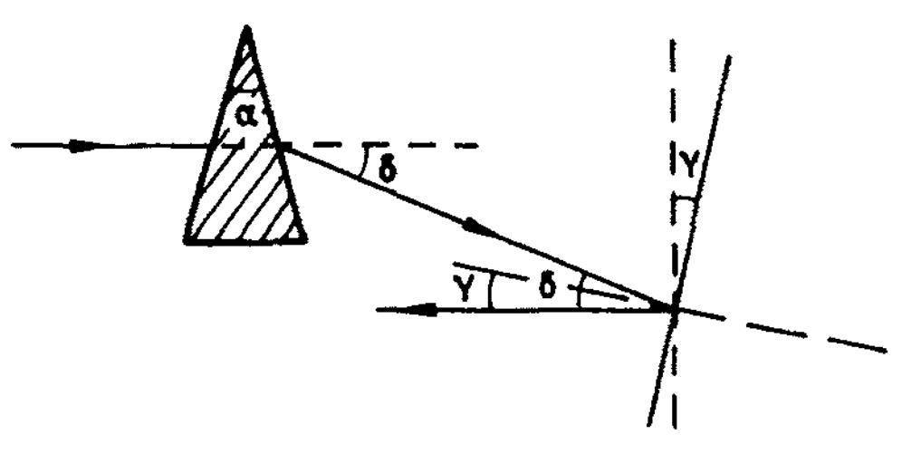

1002 Un rayo de luz horizontal atraviesa un prisma de índice de refracción 1.50 y un ángulo 4° y luego golpea un espejo vertical, como se muestra en la figura. ¿A qué ángulo debe girarse el espejo para que, después de la reflexión, el rayo sea horizontal?

De acuerdo a la siguiente figura se debe calcular primero el ángulo de desviación 

Debido a que el ángulo del prisma es pequeño se puede aproximar el ángulo de desviación como 

 

 

 

Luego, como se ilustra en la figura, el ángulo al que se debe girar el espejo es

 

 
